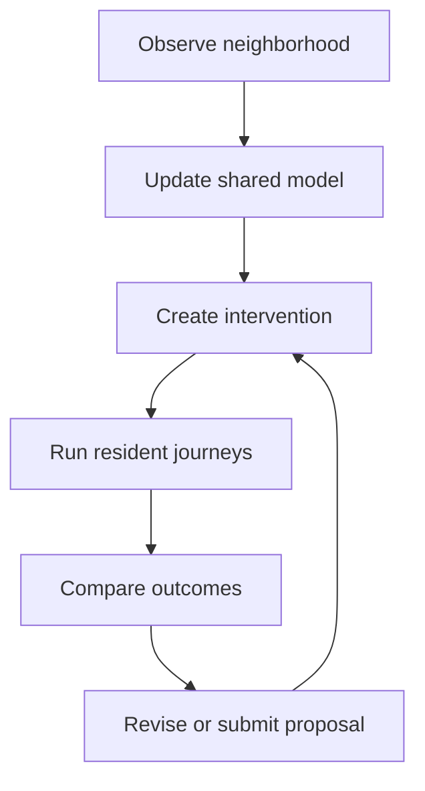
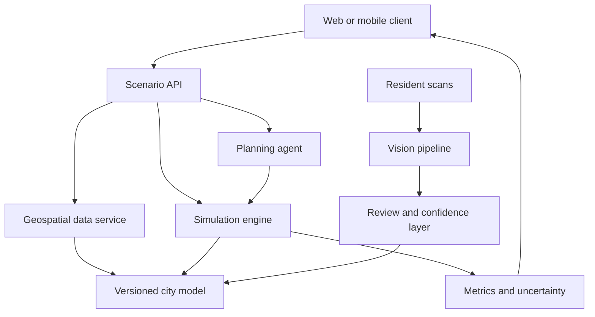
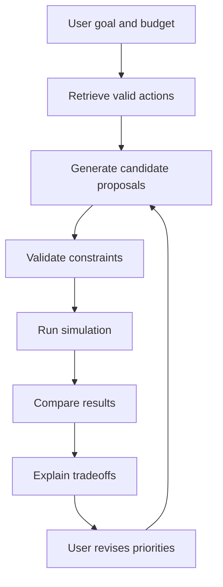

# CivicSim

## A participatory urban digital twin for testing neighborhood decisions before they are built

**Working concept document**  
**Context:** VISION HACK: South LA  
**Status:** Product vision + technical blueprint  
**One-sentence pitch:** Before Los Angeles changes a neighborhood, CivicSim lets planners and residents simulate how the change may affect the people who live there.

> For the concrete hackathon-build stack decision (frontend/backend choices, map approach, milestone order), see [`02-technical-stack-hackathon-mvp.md`](./02-technical-stack-hackathon-mvp.md).

---

## 1. Executive summary

CivicSim is an interactive, evidence-oriented planning environment built around a digital representation of a real neighborhood. A user can propose an intervention—such as adding a cooling center, moving a bus stop, installing shade, repairing a sidewalk, or adding a protected bike lane—and compare the likely effects across different groups of residents.

The key interaction is simple:

1. Select a neighborhood problem.
2. Modify the map.
3. Run thousands of synthetic resident journeys.
4. Compare the baseline and proposal.
5. Inspect who benefits, who is burdened, and why.

The system is not intended to predict the future with certainty. It is a **scenario-comparison tool**. Its job is to make assumptions visible, quantify tradeoffs consistently, reveal distributional effects, and help residents participate in planning through something more concrete than a survey or public-comment box.

The strongest first use case is **cooling-center placement**:

> Given a limited budget and several possible sites, which location gives the greatest number of heat-vulnerable residents access within a safe 15-minute walk or transit trip?

This use case is strong because it combines climate resilience, mobility, accessibility, public resources, and spatial equity while remaining easy to explain in a short demo.

At full ambition, CivicSim combines:

- a 2.5D or 3D urban digital twin;
- a multimodal neighborhood-scanning tool;
- a graph-based transportation model;
- heterogeneous synthetic resident agents;
- intervention simulation and optimization;
- an LLM-assisted planning interface;
- participatory proposal creation;
- uncertainty, provenance, and equity analysis.

Its memorable promise is not “AI plans the city.” It is:

> **People can see, test, question, and improve a proposal before public money is committed.**

---

## 2. The problem

### 2.1 Civic decisions are hard to understand before they become real

Neighborhood infrastructure decisions are often communicated through plans, hearings, PDFs, technical maps, cost tables, and written public comments. Residents may be asked whether they support a proposal without being able to explore alternatives or see how the proposal changes daily life.

A statement such as “add a bus stop at Intersection B” hides many practical questions:

- Which residents can now reach essential services faster?
- Does the stop help riders who do not own cars?
- Is the walking route to the stop shaded and wheelchair-accessible?
- Does the location create a new unsafe crossing?
- Does it improve access for one neighborhood while leaving another behind?
- What assumptions produced those conclusions?

These questions usually require separate datasets and specialized tools. CivicSim brings them into one visual, interactive environment.

### 2.2 Conventional participation captures opinions, not designs

Public engagement frequently asks residents to react to a small set of predetermined options. Even when comments are collected, it is difficult to aggregate thousands of free-form responses or understand how preferences change when people encounter real constraints such as cost, space, travel time, or accessibility.

CivicSim gives residents a design surface. Instead of only saying “we need more shade,” a resident could place trees or a shade structure on a specific block, run the scenario, and submit the resulting proposal with its measured tradeoffs.

### 2.3 Aggregate improvements can conceal unequal outcomes

A proposal can improve a citywide average while harming a smaller population. For example, average trip time might fall while wheelchair users face a newly inaccessible path. A new cooling center might maximize total reach but remain difficult to access for residents who rely on buses.

CivicSim therefore treats equity as a first-class output. Every result should be inspectable by relevant groups, travel modes, geography, and vulnerability factors rather than presented only as one composite score.

### 2.4 Planning tools can imply more certainty than the evidence supports

Urban systems are complex. A simulation result is shaped by its datasets, agent population, behavioral rules, cost functions, and missing variables. CivicSim must avoid presenting modeled outputs as guaranteed real-world outcomes.

The system should say:

> “Under these assumptions, Proposal B improved modeled access by 18%, with a plausible range of 12–23% across sensitivity runs.”

It should not say:

> “Proposal B will improve access by exactly 18%.”

This distinction is central to the credibility of the product.

---

## 3. Product thesis

### 3.1 Core thesis

Planning becomes more understandable and more democratic when people can manipulate a shared model of their neighborhood and immediately see the consequences of alternative choices.

### 3.2 Supporting theses

1. **Simulation is more useful than ungrounded generation.** An AI recommendation becomes more credible when it proposes an intervention, runs it through a defined model, and reports the measured result.
2. **Averages are insufficient.** A useful civic tool must reveal which groups gain and which groups lose.
3. **Participation should be constructive.** Residents should be able to create and compare proposals, not merely approve or reject them.
4. **Local knowledge is data.** Official datasets should be supplemented by resident observations, while preserving privacy and indicating verification status.
5. **Assumptions must be inspectable.** Every metric should have a definition, source, date, model version, and uncertainty explanation.

### 3.3 What makes CivicSim different

CivicSim is not just:

- a 3D map;
- a dashboard of existing statistics;
- a chatbot that recommends city improvements;
- a game with decorative moving characters;
- a crowdsourced issue-reporting app;
- a black-box “best location” optimizer.

It connects all of these elements into a testable loop:



---

## 4. Who CivicSim is for

### 4.1 Residents

Residents use CivicSim to understand proposals, contribute local observations, design alternatives, and communicate preferences in a spatially specific way.

Their core question is:

> “What would this change mean for people like me and for my block?”

The interface for residents should use plain language, guided tasks, large visual feedback, mobile support, multilingual content, and explicit explanations of uncertainty.

### 4.2 Community organizations

Neighborhood councils, advocacy groups, schools, nonprofits, and mutual-aid organizations can use CivicSim to document local needs, facilitate workshops, and develop evidence-backed proposals.

Their core question is:

> “Can we turn what our community knows into a proposal that is difficult to ignore?”

### 4.3 City planners and public agencies

Planners use CivicSim as an early-stage scenario tool before commissioning a full engineering, environmental, or transportation study. It helps them screen options, discover conflicts, and explain proposals publicly.

Their core question is:

> “Which alternatives deserve deeper professional analysis, and what equity issues should we investigate?”

### 4.4 Researchers and students

Researchers can define alternative behavioral models, evaluate participatory methods, and test how interface design changes public understanding of complex tradeoffs.

Their core question is:

> “How do people reason about civic choices when they can see and manipulate a model?”

---

## 5. The first flagship scenario: cooling-center placement

### 5.1 User story

A neighborhood has funding to open one cooling center during extreme-heat events. Three candidate buildings are available. A planner or resident needs to compare them.

The user opens CivicSim and sees:

- the neighborhood road and transit network;
- a heat-vulnerability layer;
- existing cooling resources;
- homes, schools, parks, and relevant public facilities;
- synthetic residents moving through representative daily journeys.

The user selects **Find cooling-center locations**. CivicSim generates or loads three candidates and shows the reason each is plausible.

When the user clicks **Run comparison**, agents travel from sampled origins to each candidate. The simulation accounts for walking distance, transit availability, heat exposure, sidewalk conditions, mobility constraints, hours of operation, and site capacity.

The result is not a single winner with no explanation. It is a comparison:

| Metric | Baseline | Site A | Site B | Site C |
| --- | ---: | ---: | ---: | ---: |
| Residents within 15 minutes | 8,420 | 11,130 | 12,980 | 13,410 |
| Heat-vulnerable residents reached | 3,120 | 4,020 | 5,340 | 5,110 |
| Wheelchair-accessible reach | 61% | 68% | 82% | 71% |
| Average heat exposure en route | 18.4 min | 15.7 min | 12.9 min | 14.1 min |
| Estimated daily demand / capacity | — | 64% | 93% | 122% |
| Estimated setup cost | — | $310K | $470K | $390K |

*The values above are illustrative interface content, not real estimates.*

Site C maximizes raw access, but demand exceeds capacity. Site B serves slightly fewer people, performs better for wheelchair users and heat-vulnerable residents, and remains within capacity. The “optimal” choice therefore depends on the public objective.

### 5.2 Why this is a good demonstration

It creates visible action on the map:

- candidate locations glow;
- origin points appear;
- animated routes flow toward each site;
- unreachable residents remain visible;
- a heat map changes as proposals are compared;
- charts update in real time;
- selecting a subgroup redraws the analysis.

It also demonstrates the moral and technical core of CivicSim: maximizing a total is not the same as serving a community fairly.

### 5.3 The strongest reveal

The presenter initially shows that Site C has the highest overall accessibility. Then they toggle **Residents using mobility devices**. Site C falls behind Site B because several routes contain inaccessible curb transitions or steep segments.

That moment communicates why heterogeneous agents and equity breakdowns matter better than a long technical explanation.

---

## 6. Other intervention modules

CivicSim should be a platform with a small number of intervention primitives rather than a separate application for every civic problem.

### 6.1 Shade and heat

Possible interventions:

- add a tree or tree cluster;
- install a shade canopy;
- add a shaded bus shelter;
- add a water station;
- designate a cooling center;
- change facility hours.

Possible outputs:

- modeled heat exposure by journey;
- shaded-route coverage;
- cooling-resource reach;
- vulnerable population served;
- maintenance and water assumptions;
- time-to-benefit, since young trees do not provide mature canopy immediately.

### 6.2 Pedestrian safety

Possible interventions:

- add or move a crosswalk;
- add pedestrian-scale lighting;
- install a curb extension;
- add a pedestrian refuge;
- modify signal timing;
- repair an obstructed sidewalk.

Possible outputs:

- number of modeled conflict points;
- safe-route availability;
- detour distance for risk-averse travelers;
- school-route effects;
- accessibility effects;
- estimated intervention cost.

### 6.3 Transit access

Possible interventions:

- add or relocate a bus stop;
- change service frequency;
- create a first/last-mile shuttle;
- add a shelter or seating;
- improve a walking connection to an existing stop.

Possible outputs:

- reachable destinations within 15, 30, or 45 minutes;
- transfer burden;
- average wait time;
- essential-service access;
- transit access by subgroup;
- ridership demand relative to capacity.

### 6.4 Bicycle infrastructure

Possible interventions:

- protected bike lane;
- painted lane;
- bike parking;
- traffic-calmed connector;
- shared-bike station.

Possible outputs:

- low-stress network connectivity;
- modeled cycling uptake under explicit assumptions;
- dangerous crossing exposure;
- access to jobs or services;
- effects on other travel modes;
- business frontage and parking tradeoffs.

### 6.5 Public-space and park improvements

Possible interventions:

- seating;
- lighting;
- shade;
- accessible path;
- playground repair;
- water fountain;
- program or event space.

Possible outputs:

- walking access;
- likely usage by time of day;
- age-group reach;
- accessibility;
- heat exposure;
- maintenance burden.

---

## 7. Core product experience

### 7.1 Mode 1: Explore

The user explores the neighborhood model without changing it.

They can toggle layers such as:

- heat vulnerability;
- shade or canopy;
- sidewalk condition;
- curb ramps;
- transit stops;
- schools and parks;
- public facilities;
- 311 reports;
- modeled 15-minute access;
- data freshness and confidence.

Clicking an object opens a plain-language evidence panel:

> **Bus Stop 0421**  
> Routes: 2  
> Shelter: No  
> Seating: No  
> Shade estimate: Low  
> Last verified: July 2026  
> Sources: transit feed + resident scan

### 7.2 Mode 2: Design

The user enters an editable proposal workspace. A palette contains only the interventions supported by the active module.

For example:

- drag a cooling-center marker onto an eligible facility;
- draw a protected bike lane along compatible road segments;
- place a crosswalk at an intersection;
- select a bus stop and change its location;
- add a shade structure to a transit waiting area.

Every action creates a structured intervention object rather than merely changing the picture.

```json
{
  "type": "cooling_center",
  "facility_id": "facility_204",
  "capacity": 180,
  "hours": "10:00-20:00",
  "accessible_entrance": true,
  "estimated_cost": 390000
}
```

### 7.3 Mode 3: Simulate

The user chooses:

- the proposal to test;
- the affected time window;
- weather or demand scenario;
- population sample size;
- priority objective;
- optional subgroup filters.

The interface then displays progress in meaningful stages:

1. Loading neighborhood graph.
2. Sampling resident journeys.
3. Applying accessibility constraints.
4. Routing agents.
5. Calculating outcomes.
6. Running uncertainty checks.

The animation should communicate computation without falsely implying that every moving dot is a real individual.

### 7.4 Mode 4: Compare

Comparison is the heart of the product. The user sees baseline and proposal side by side.

The primary screen should contain:

- a map difference view;
- four to six headline metrics;
- a distributional breakdown;
- a tradeoff statement;
- an assumptions and confidence drawer;
- a list of residents or blocks that remain underserved.

Good language:

> “Proposal B reduces modeled median walking exposure by 4.2 minutes. The largest gains occur west of Vermont Avenue. Two southeastern blocks remain outside the 15-minute threshold.”

Bad language:

> “Proposal B solves heat access.”

### 7.5 Mode 5: Participate

A resident can:

- endorse an existing proposal;
- fork it and move an intervention;
- attach a local observation;
- describe a concern;
- compare their version with the official proposal;
- submit the proposal to a community collection.

The system aggregates designs into patterns rather than reducing participation to a popularity contest.

Example:

> **1,382 submitted designs**  
> 78% added shade near transit  
> 63% moved the crossing north  
> 51% preserved curbside loading  
> Four recurring proposal families were identified

The interface should also surface minority concerns:

> “Although Proposal Family 2 received fewer submissions, wheelchair users consistently flagged the east entrance as inaccessible.”

---

## 8. System architecture



### 8.1 Presentation layer

Responsibilities:

- render the 2D, 2.5D, or 3D map;
- animate agents and network flows;
- provide proposal editing tools;
- display comparisons and explanations;
- show data provenance and confidence;
- support desktop planning and mobile observation capture.

Possible implementation choices:

- **Fastest polished prototype:** React or Next.js + MapLibre GL JS or deck.gl.
- **More cinematic 3D twin:** React + CesiumJS.
- **Game-like interaction:** Unity with geospatial data, though browser deployment and iteration may be heavier.

CesiumJS is designed for web-based 3D geospatial visualization and can display terrain, buildings, and time-varying geospatial data. A 2.5D deck.gl or MapLibre experience may be easier to control and can still look exceptional. CivicSim should choose 3D only if depth improves the decision being shown; visual spectacle alone is not enough.

### 8.2 Scenario API

The Scenario API is the contract between the interface and the analytical system. It should support:

- retrieving a versioned neighborhood;
- creating and updating a proposal;
- validating whether an intervention is allowed;
- starting a simulation run;
- polling or streaming progress;
- retrieving results;
- comparing runs;
- retrieving metric definitions and provenance.

Representative endpoints:

```text
GET    /neighborhoods/{id}
GET    /neighborhoods/{id}/layers
POST   /scenarios
PATCH  /scenarios/{id}/interventions
POST   /scenarios/{id}/runs
GET    /runs/{id}
GET    /runs/{id}/results
POST   /runs/compare
GET    /metrics/{metric_id}/definition
```

### 8.3 Versioned city model

The city model is not one giant image. It is a set of connected spatial objects and networks.

Core entities:

- road segment;
- sidewalk segment;
- intersection;
- crossing;
- transit stop;
- transit route;
- building or facility;
- parcel or zone;
- park or public space;
- shade region;
- resident observation;
- intervention;
- simulation scenario;
- model run.

Each important feature should contain:

- geometry;
- attributes;
- source;
- source date;
- last verification date;
- confidence or quality flag;
- model version;
- visibility and privacy rules.

PostgreSQL with PostGIS is a natural backing store because it supports spatial geometry, indexing, and queries. A graph projection can be generated for routing and simulation.

### 8.4 Simulation engine

The engine runs independently of the visual client. It receives a baseline city-model version, a set of interventions, a population seed, and a scenario configuration. It returns aggregate results plus trace information needed for explanation.

Possible implementation approaches:

- custom Python engine using NetworkX, NumPy, GeoPandas, and multiprocessing;
- Mesa for explicit agent-based modeling structure;
- a specialized mobility simulator if the project grows toward traffic realism;
- a hybrid approach in which graph-based accessibility metrics run quickly and detailed agent simulations run only for selected scenarios.

For an ambitious prototype, a custom graph-based engine may be easier to explain and control than a large mobility package. Mesa can help structure heterogeneous agents, scheduling, data collection, and repeated runs.

### 8.5 Planning agent

The LLM-based planning agent sits above—not inside—the core numerical result. Its role is to translate user intent into candidate scenarios and explain results.

It may:

- interpret “improve heat-safe access around this school”;
- retrieve applicable intervention types and constraints;
- generate two to five candidate proposals;
- ask the simulation engine to evaluate each proposal;
- compare results against the chosen objective;
- produce a plain-language explanation with citations to model inputs.

It must not invent simulation outcomes. Every numerical claim should be derived from a completed model run.

Recommended tool boundary:

```text
LLM can propose: intervention type, location candidates, objective weights
Simulation decides: routes, outcomes, scores, constraint violations
Database provides: source data, cost assumptions, facility eligibility
UI exposes: evidence, uncertainty, and tradeoffs
```

### 8.6 Vision and neighborhood-observation pipeline

Resident-contributed images can fill gaps in official data. A user photographs a street or facility. The pipeline estimates or detects relevant features such as:

- tree canopy and shade;
- sidewalk obstruction;
- curb ramp presence;
- crosswalk presence and visibility;
- seating;
- shelter;
- lighting fixtures;
- dumped material;
- construction blockage.

The pipeline should return structured observations with confidence, not silently mutate the city model.

```json
{
  "observation_type": "crosswalk_visibility",
  "value": "poor",
  "confidence": 0.78,
  "location": {"lat": 0.0, "lon": 0.0},
  "capture_time": "...",
  "review_status": "unverified"
}
```

Low-confidence or high-impact observations should require review. Multiple observations can be fused, with disagreements remaining visible.

---

## 9. Modeling the neighborhood as a graph

### 9.1 Multilayer graph

CivicSim should represent mobility as a multilayer graph rather than one road network.

Layers may include:

- walking;
- wheelchair-accessible walking;
- cycling;
- transit;
- driving;
- facility access.

Nodes represent intersections, stops, entrances, and transfer points. Edges represent traversable segments. Each edge contains mode-specific costs.

Example walking-edge attributes:

```text
length_meters
estimated_time_seconds
slope
shade_fraction
sidewalk_quality
crossing_risk
curb_ramp_status
construction_status
night_lighting
confidence
```

### 9.2 Generalized route cost

Agents should not all choose the geometric shortest path. A route can be evaluated using a generalized cost:

$$
C(r,a)=w_t(a)T(r)+w_h(a)H(r)+w_s(a)S(r)+w_c(a)M(r)+w_\$(a)P(r)
$$

where:

- $r$ is a route;
- $a$ is an agent profile;
- $T$ is travel time;
- $H$ is heat exposure;
- $S$ is safety or stress cost;
- $M$ is mobility-access barrier cost;
- $P$ is monetary cost;
- each $w$ is an agent-specific preference or constraint weight.

For some accessibility barriers, the cost should be infinite rather than merely inconvenient. For example, a stair-only segment may be non-traversable for an agent using a wheelchair.

### 9.3 Interventions modify graph structure or weights

Examples:

- a new crosswalk adds a traversable connection;
- a repaired curb ramp changes an inaccessible edge to accessible;
- added shade reduces heat-exposure cost;
- a relocated bus stop changes transfer nodes;
- increased transit frequency reduces expected wait cost;
- construction temporarily removes an edge.

This makes proposal testing computationally meaningful. The UI changes the city, the city modifies the graph, and the graph changes agent behavior.

---

## 10. Synthetic resident agents

### 10.1 What an agent represents

An agent is not a digital copy of a named resident. It is a synthetic decision-making unit representing a combination of location, travel needs, constraints, and priorities.

Example:

```yaml
agent_id: synthetic_1382
home_zone: vermont_square_07
journey_purpose: groceries
available_modes:
  - walk
  - bus
mobility_profile: avoids_stairs
vehicle_access: false
heat_sensitivity: high
time_sensitivity: medium
cost_sensitivity: high
```

### 10.2 Agent heterogeneity

At minimum, agents can vary by:

- origin zone;
- destination or need;
- available transportation modes;
- time of day;
- maximum acceptable travel time;
- mobility constraints;
- heat sensitivity;
- safety sensitivity;
- household obligations;
- cost sensitivity.

Examples of representative journeys:

- resident traveling from home to a cooling center;
- child traveling to school with an adult;
- worker combining a school drop-off and a commute;
- older adult traveling to a pharmacy;
- wheelchair user reaching a public facility;
- transit rider buying groceries and returning home.

### 10.3 Population generation

The system can generate a synthetic population from aggregated census, land-use, and travel data. It should not claim that any synthetic agent corresponds to a real person.

A defensible process would:

1. define population dimensions relevant to the scenario;
2. use aggregated distributions at the smallest safe geographic level;
3. sample reproducibly using a recorded seed;
4. validate aggregate distributions against source data;
5. prohibit reconstruction of individual identities;
6. expose the population-generation method.

### 10.4 Behavior rules versus LLM agents

Most movement decisions should use explicit rules, graph search, probability distributions, or learned mobility models—not thousands of free-running LLM calls.

LLM-controlled resident agents may be useful for qualitative deliberation or persona-based explanation, but they are a poor foundation for reproducible routing metrics because they are expensive, variable, and difficult to validate.

A sound hybrid model is:

- deterministic or probabilistic algorithms for movement;
- LLMs for proposal generation, natural-language explanation, and controlled qualitative feedback;
- logged seeds and model versions for reproducibility.

---

## 11. Metrics

### 11.1 Access metrics

- residents within 10, 15, 30, or 45 minutes of a resource;
- reachable essential destinations;
- average and percentile travel time;
- number of required transfers;
- service hours matched to resident availability;
- capacity-adjusted access.

### 11.2 Safety and comfort metrics

- dangerous or high-stress crossings encountered;
- distance traveled on low-quality sidewalks;
- unshaded exposure time;
- distance without lighting at night;
- barrier-free route availability;
- perceived-risk proxy, clearly labeled as modeled.

### 11.3 Equity metrics

- outcome gap between population groups;
- worst-served decile improvement;
- geographic distribution of benefits;
- share of benefits reaching high-vulnerability zones;
- number and location of residents made worse off;
- minimum-service threshold attainment.

### 11.4 Cost and feasibility metrics

- capital cost range;
- ongoing operating and maintenance cost;
- implementation time;
- physical or regulatory constraints;
- facility or network capacity;
- dependencies on other interventions.

### 11.5 Avoiding the false precision trap

The interface should prefer ranges and distributions when inputs are uncertain. If estimated cost is only known within a wide interval, CivicSim should not display `$417,362` merely because the calculation permits it.

Good:

> Estimated cost: **$350K–$500K**  
> Modeled access gain: **12–23% across tested assumptions**

Bad:

> Cost: **$417,362**  
> Access gain: **18.274%**

---

## 12. Optimization and the meaning of “best”

There is rarely one objectively optimal civic proposal. CivicSim should allow users to make the objective function explicit.

Example:

$$
Score(p)=\alpha A(p)+\beta E(p)+\gamma S(p)-\delta C(p)-\epsilon D(p)
$$

where:

- $A$ = overall access improvement;
- $E$ = equity improvement;
- $S$ = safety improvement;
- $C$ = cost;
- $D$ = disruption or negative externalities;
- coefficients express public priorities.

Instead of hiding these weights, CivicSim should show them and allow controlled adjustment.

It can also produce a **Pareto frontier**: a set of proposals for which no objective can improve without worsening another. This is often more honest and useful than announcing one winner.

Example outputs:

- Proposal A: lowest cost;
- Proposal B: best accessibility equity;
- Proposal C: greatest total reach;
- Proposal D: best balance under the currently selected weights.

---

## 13. Uncertainty, validation, and trust

### 13.1 Every run needs a model card

Each result should include:

- scenario name;
- neighborhood-model version;
- source-data dates;
- agent population version;
- intervention assumptions;
- number of agents and repeated runs;
- random seed or seed policy;
- metric definitions;
- known missing variables;
- sensitivity results;
- intended and prohibited uses.

### 13.2 Sensitivity analysis

If a result changes dramatically when one uncertain assumption moves slightly, the interface should warn the user.

For example:

> “Site B ranks first when transit wait time is under 12 minutes. Site C ranks first when average wait exceeds 18 minutes. Verify current service reliability before making a decision.”

### 13.3 Validation strategy

Long-term validation can happen at several levels:

1. **Data validation:** Are map features and attributes accurate?
2. **Routing validation:** Do modeled routes resemble routes people can and do take?
3. **Population validation:** Do synthetic population aggregates match public statistics?
4. **Behavior validation:** Are mode and route choices plausible under observed conditions?
5. **Outcome validation:** When an intervention is implemented, do before/after observations align with predicted ranges?
6. **Human validation:** Do residents recognize the model as a meaningful representation of their lived environment?

### 13.4 Human-readable provenance

Every metric should have a “Why am I seeing this?” affordance.

Example:

> **Wheelchair-accessible reach: 82%**  
> Calculated from 1,200 synthetic journeys. Routes containing stairs or unverified curb transitions were excluded. Sidewalk accessibility data came from the city layer dated May 2026 plus 14 resident observations. Six intersections remain unverified.

---

## 14. Resident sensing and computer vision

### 14.1 Capture flow

1. Resident chooses an observation category or uses automatic detection.
2. App provides framing guidance.
3. Photo or short video is captured.
4. Device removes unnecessary metadata and detects faces/license plates for redaction.
5. Model identifies relevant features.
6. Resident confirms or corrects the structured observation.
7. Observation enters the map as unverified, community-confirmed, or reviewed.

### 14.2 Privacy-first design

The application should minimize collection:

- crop to the relevant infrastructure;
- redact faces and license plates;
- avoid storing raw media when a structured observation is sufficient;
- communicate location precision clearly;
- allow deletion and correction;
- prevent use for policing, immigration enforcement, or individual tracking;
- define retention periods.

### 14.3 Confidence and verification states

Suggested states:

| State | Meaning |
| --- | --- |
| Unverified | One automated or resident observation exists |
| Community-confirmed | Multiple independent observations agree |
| Conflicted | Observations disagree or conditions may have changed |
| Reviewed | Verified by an authorized reviewer or trusted survey |
| Stale | Observation exceeds the freshness threshold |

The map should never make all layers look equally authoritative.

---

## 15. Participatory planning as an HCI system

The participatory layer may be the most original research contribution. Most dashboards show residents a finished analysis. CivicSim lets residents modify the analysis object itself.

### 15.1 Proposal workshops

A community organization could host a workshop:

1. Participants explore an existing proposal.
2. Facilitator explains constraints and metrics.
3. Individuals or groups create alternatives.
4. CivicSim runs each alternative.
5. Participants discuss visible tradeoffs.
6. Proposals are clustered by design similarity.
7. Minority concerns are preserved alongside popular patterns.

### 15.2 Preventing “simulation authority”

The simulation should support deliberation, not end it. The interface can explicitly distinguish:

- **modeled knowledge:** travel-time estimate;
- **observed knowledge:** resident-uploaded obstruction;
- **lived experience:** resident reports feeling unsafe at night;
- **normative choice:** whether safety, speed, cost, or equity should receive more weight.

The system can compute outcomes, but it cannot decide which public values are correct.

### 15.3 Accessibility of the participation experience

Participation should not require a high-end computer or technical vocabulary. Possible access modes include:

- lightweight 2D mobile mode;
- kiosk mode for libraries and community centers;
- facilitated workshop mode;
- screen-reader-compatible proposal forms;
- multilingual plain-language explanations;
- low-bandwidth static comparisons;
- printable proposal summaries.

---

## 16. Visual and interaction design direction

### 16.1 Desired feeling

CivicSim should feel like a living, serious civic instrument—not a generic admin dashboard and not a dystopian surveillance center.

The visual language could combine:

- warm satellite or map colors;
- clear cyan or gold proposal highlights;
- softly animated flows;
- physical-looking intervention tokens;
- restrained glass panels;
- typography large enough for public presentation;
- a strong distinction between observed, estimated, and proposed layers.

### 16.2 Main screen composition

- **Center:** neighborhood map or digital twin.
- **Left rail:** goal, layers, and intervention palette.
- **Right panel:** active object, proposal details, or result comparison.
- **Bottom timeline:** baseline, proposal, simulation, comparison.
- **Top bar:** neighborhood, scenario date, data freshness, model version.

### 16.3 Agent animation

Moving agents should be an explanatory visualization, not decoration.

Useful behavior:

- aggregate into flows when zoomed out;
- become individual dots only when zoomed in;
- show a sampled subset while calculations use more agents;
- color by outcome, not demographic identity;
- provide a legend stating that agents are synthetic;
- allow users to pause and inspect representative journeys.

### 16.4 Before/after interaction

Possible patterns:

- draggable comparison divider;
- synchronized side-by-side maps;
- baseline ghost geometry behind the proposal;
- time-lapse transition;
- metric deltas attached directly to affected areas.

The interface should make the change legible within three seconds.

---

## 17. North-star demo

### 17.1 Five-minute sequence

**0:00–0:30 — Human problem**

> “A neighborhood has funding for one cooling center. Three sites look reasonable. Choosing the wrong one could leave thousands of residents unable to reach help safely during extreme heat.”

**0:30–1:00 — Establish the twin**

Show South LA with roads, facilities, transit, heat, shade, and moving synthetic journeys.

> “This is not just a map. It is a testable model of how different residents reach essential resources.”

**1:00–1:45 — Run the baseline**

Show current cooling-resource access. Select a block outside the threshold and inspect a representative journey.

**1:45–2:30 — Generate candidates**

Ask:

> “Where could we place one new center under a $500,000 budget?”

The planning agent creates three candidate interventions, explains eligibility, and calls the simulator.

**2:30–3:15 — Simulation moment**

Agents and route flows animate. Results appear as each scenario finishes.

**3:15–4:00 — Equity reveal**

Site C wins on total access. Toggle wheelchair-accessible reach or heat-vulnerable residents; Site B becomes the stronger equitable option. Show the assumptions behind the result.

**4:00–4:35 — Resident participation**

Move the entrance or add shade to Site B. Recalculate. Demonstrate that a resident can fork the official design and improve it.

**4:35–5:00 — Closing**

> “CivicSim does not replace residents, planners, or engineering studies. It gives them a shared place to ask better questions before a decision becomes concrete.”

### 17.2 Optional “physical world” finale

A teammate uses the mobile capture screen to photograph an unshaded sidewalk. The vision pipeline produces:

> Low shade observed — confidence 84% — awaiting confirmation

The corresponding segment updates on the projected twin. This closes the loop:

```text
physical neighborhood → resident observation → shared model → simulation → proposal
```

---

## 18. A technically honest prototype

A prototype does not need to model all of South LA or claim production accuracy. It can be impressive if it is narrow and internally coherent.

### 18.1 Recommended prototype boundary

- one neighborhood slice;
- one flagship problem: cooling-center placement;
- three candidate sites;
- four agent types;
- walking plus transit;
- five primary metrics;
- one editable intervention;
- one resident scan that updates one environmental attribute;
- one planning-agent workflow;
- baseline and proposal comparison;
- transparent mock or sourced data labels.

### 18.2 Real computation versus staged content

**Should be real:**

- route finding;
- agent-specific path constraints;
- metric aggregation;
- proposal-dependent results;
- seeded repeated runs;
- intervention validation;
- at least one uncertainty test.

**Can be preprocessed:**

- neighborhood geometry;
- candidate facilities;
- synthetic population;
- environmental layers;
- expensive vision inference;
- 3D building tiles.

**Can be explicitly mocked for a hackathon:**

- official permitting workflow;
- actual project cost estimates;
- live agency integration;
- comprehensive accessibility coverage;
- real-time traffic and heat forecasts.

The demo should label mock values rather than blur the line between prototype and deployment.

---

## 19. Suggested technical stack

This is one coherent option, not the only correct stack.

### Frontend

- React or Next.js;
- TypeScript;
- deck.gl + MapLibre GL JS for a controllable 2.5D experience, or CesiumJS for a more geographic 3D twin;
- Web Workers for local animation and lightweight client computation;
- a charting library for metric comparison;
- a lightweight state store for scenario editing.

### Backend

- Python + FastAPI;
- PostgreSQL + PostGIS;
- Redis or a simple job queue for simulation runs;
- object storage for approved media and model artifacts;
- server-sent events or WebSockets for run progress.

### Modeling

- GeoPandas for spatial preparation;
- NetworkX for initial graph routing;
- NumPy/Pandas for simulation and aggregation;
- Mesa if its agent lifecycle and data collection meaningfully reduce custom work;
- OR-Tools or another optimizer for constrained site selection;
- reproducible seeds and configuration files for every run.

### AI

- multimodal model or dedicated vision models for structured street observations;
- LLM with tool calling for goal interpretation, candidate generation, and explanation;
- strict structured schemas between AI components and deterministic services;
- retrieval from metric definitions, planning constraints, and data provenance.

### Deployment

- static or edge-hosted frontend;
- containerized simulation API;
- precomputed neighborhood packages;
- cached results for common proposals;
- graceful fallback to recorded demo runs if the live computation fails on stage.

---

## 20. Example data model

### 20.1 Scenario

```json
{
  "scenario_id": "cooling_v1_site_b",
  "title": "Site B with shaded approach",
  "base_model_version": "south_la_demo_2026_09",
  "objective": {
    "total_access": 0.25,
    "heat_vulnerable_access": 0.35,
    "wheelchair_access": 0.25,
    "cost": 0.15
  },
  "interventions": [
    {"type": "cooling_center", "facility_id": "facility_b"},
    {"type": "shade", "edge_ids": ["e18", "e19", "e23"]}
  ]
}
```

### 20.2 Simulation run

```json
{
  "run_id": "run_9fd2",
  "scenario_id": "cooling_v1_site_b",
  "engine_version": "0.3.0",
  "population_version": "demo_pop_2",
  "seed": 24791,
  "agent_count": 2500,
  "repetitions": 30,
  "status": "completed",
  "warnings": [
    "Six curb transitions have unverified accessibility status"
  ]
}
```

### 20.3 Metric result

```json
{
  "metric": "heat_vulnerable_access_15m",
  "baseline": 0.54,
  "proposal_mean": 0.72,
  "proposal_interval": [0.66, 0.77],
  "unit": "share_of_population",
  "definition_version": "1.1",
  "provenance": ["population_layer_7", "walk_graph_12", "heat_layer_4"]
}
```

---

## 21. Planning-agent workflow

The planning agent should follow a constrained loop.



Example:

**User:** “Improve safe heat access around this school for less than $500,000.”

**Agent actions:**

1. Resolve the school and affected area.
2. Retrieve allowed shade, crossing, and cooling interventions.
3. Identify network bottlenecks and eligible facilities.
4. Generate candidate bundles.
5. Validate spatial and budget constraints.
6. Call the simulator for each bundle.
7. Retrieve distributional metrics and uncertainty.
8. Explain the Pareto-efficient options.
9. Invite the user to change priorities.

The agent should be prohibited from describing a proposal as “best” unless it names the objective under which it is best.

---

## 22. Evaluation plan

### 22.1 Technical evaluation

- routing correctness on known test paths;
- reproducibility with fixed seeds;
- scenario isolation: interventions do not leak between runs;
- performance as agent count grows;
- metric consistency across frontend and backend;
- provenance completeness;
- graceful handling of missing data.

### 22.2 Model evaluation

- compare routes with observed or expert-assessed routes;
- compare baseline accessibility metrics with established tools where possible;
- test sensitivity to uncertain inputs;
- evaluate whether rankings remain stable across model variations;
- measure false positive and false negative rates for vision observations.

### 22.3 HCI evaluation

Possible research questions:

- Does interactive simulation improve residents’ understanding of planning tradeoffs?
- Does exposing uncertainty reduce overtrust without making the tool unusable?
- Do residents create meaningfully different proposals when given simulation feedback?
- Does subgroup analysis help users identify equity effects they otherwise miss?
- Does an AI planning assistant increase participation, or does it anchor users toward machine-generated proposals?

Possible measures:

- task completion;
- decision comprehension;
- calibration of trust;
- perceived agency;
- perceived procedural fairness;
- ability to identify winners and losers;
- diversity of submitted proposals;
- qualitative feedback from residents and planners.

### 22.4 Community evaluation

A meaningful evaluation should involve local partners early enough to change the system, not merely validate a finished design. Questions include:

- Are the modeled problems actually important locally?
- Are the intervention choices realistic?
- Which forms of local knowledge are missing?
- Does the interface make community expertise visible?
- Could the tool create political or surveillance harms?
- Who has the power to publish, verify, or remove observations?

---

## 23. Risks and safeguards

### 23.1 False authority

**Risk:** A visually impressive twin may make speculative outputs appear official or scientifically certain.

**Safeguards:** uncertainty ranges, model cards, source badges, prohibited-use statements, sensitivity analysis, and language that distinguishes scenarios from forecasts.

### 23.2 Biased or incomplete data

**Risk:** Areas with more data collection may appear to have more problems; missing sidewalk data can systematically erase disabled residents’ needs.

**Safeguards:** data-coverage maps, missingness as a visible layer, targeted validation, community review, and refusal to interpret “no data” as “no problem.”

### 23.3 Synthetic-agent stereotyping

**Risk:** Demographic labels may become simplistic behavioral assumptions.

**Safeguards:** model constraints and needs rather than personality stereotypes; document every behavior rule; involve affected communities; analyze outcomes by multiple dimensions; avoid generating fictional individual narratives as evidence.

### 23.4 Privacy and surveillance

**Risk:** Street images and precise resident data could be repurposed to monitor individuals.

**Safeguards:** aggregated populations, media minimization, redaction, retention limits, access controls, purpose limitation, and a ban on enforcement-oriented individual tracking.

### 23.5 Participation inequality

**Risk:** Digitally confident residents could dominate proposal creation.

**Safeguards:** facilitated sessions, kiosks, mobile and low-bandwidth modes, multilingual support, accessible design, offline collection, and reporting of who participated.

### 23.6 Optimization laundering

**Risk:** Political value choices may be hidden inside a technical score.

**Safeguards:** expose objective weights, show Pareto alternatives, separate facts from values, and preserve minority objections.

### 23.7 Stale digital twin

**Risk:** Infrastructure changes faster than the model is updated.

**Safeguards:** freshness badges, expiration rules, resident observations, conflict states, and the ability to rerun scenarios on updated model versions.

---

## 24. Development roadmap

### Phase 0 — Narrative prototype

**Goal:** Validate whether the interaction and pitch make sense.

Build:

- one designed neighborhood screen;
- predetermined baseline and three proposal results;
- animated flows;
- subgroup toggle;
- assumptions panel;
- clickable proposal edit.

This phase can use illustrative data, clearly labeled.

### Phase 1 — Computational proof

**Goal:** Make the key outcome genuinely respond to the proposal.

Build:

- real walk graph for a small area;
- three agent profiles;
- origin sampling;
- cooling-center placement;
- shortest/generalized-cost routing;
- baseline/proposal metrics;
- fixed-seed reproducibility.

### Phase 2 — Technical showcase

**Goal:** Demonstrate the complete CivicSim loop.

Add:

- transit layer;
- multiple simulation runs;
- uncertainty range;
- planning agent with tools;
- computer-vision observation;
- one editable shade intervention;
- polished 2.5D or 3D visualization;
- provenance drawer.

### Phase 3 — Community pilot

**Goal:** Learn whether the system supports real deliberation.

Add:

- resident accounts or anonymous workshop sessions;
- proposal forking and submission;
- multilingual and accessible modes;
- observation review workflow;
- participation analytics;
- community partner feedback;
- clear governance policy.

### Phase 4 — Research-grade platform

**Goal:** Support validated comparative studies.

Add:

- calibrated synthetic populations;
- external model comparison;
- scenario versioning;
- model registry;
- formal evaluation studies;
- partner-approved metric definitions;
- audit logs;
- exportable reports and datasets.

### Phase 5 — Operational decision support

**Goal:** Inform real planning without overstating the model.

Requires:

- agency and community governance;
- professional validation;
- robust privacy and security review;
- maintenance funding;
- data-sharing agreements;
- accessible public documentation;
- long-term ownership and accountability.

---

## 25. Team structure

For a four- or five-person team:

### Product and pitch lead

- owns problem framing and user story;
- keeps scope centered on one decision;
- writes the demo narrative;
- verifies that every technical component supports the thesis.

### Geospatial and data engineer

- prepares map layers;
- constructs graph and spatial database;
- manages data provenance;
- builds scenario transformations.

### Simulation engineer

- defines agents and route cost;
- implements runs and metrics;
- ensures reproducibility;
- builds comparison and uncertainty output.

### Frontend and visualization engineer

- creates map and intervention UI;
- animates flows;
- builds comparison views;
- optimizes the stage demo.

### AI and sensing engineer

- builds planner tool flow;
- implements structured vision output;
- handles evidence-linked explanations;
- enforces the boundary between generated and computed claims.

With fewer people, combine product with frontend and combine AI with simulation.

---

## 26. What to cut first

If time or complexity becomes a problem, cut in this order:

1. full photorealistic 3D buildings;
2. live camera inference;
3. general-purpose natural-language planning;
4. multiple intervention categories;
5. real-time transit;
6. proposal clustering;
7. account system;
8. large geographic coverage.

Do not cut:

- a real baseline/proposal difference;
- heterogeneous resident constraints;
- a visible equity tradeoff;
- provenance and uncertainty language;
- one memorable interactive moment;
- a clear statement of what is simulated versus real.

The value of CivicSim survives without photorealistic buildings. It does not survive if the “simulation” is just hard-coded numbers behind a beautiful map.

---

## 27. Success criteria

### Hackathon success

- A judge understands the problem within 20 seconds.
- The live proposal visibly changes agent behavior and metrics.
- The equity reveal is understandable without technical explanation.
- The team can explain which computation is real.
- The demo works reliably in under five minutes.
- The project has one image or interaction people remember afterward.

### Product success

- Residents can identify how a proposal affects them.
- Planners discover a tradeoff or underserved group earlier.
- Community proposals are spatially specific and comparable.
- Users understand the model’s uncertainty.
- Model results can be reproduced and audited.

### Research success

- CivicSim enables a defensible study of participatory simulation.
- Its intervention and metric definitions are reproducible.
- Community feedback changes the model or interface.
- The work contributes insight beyond the software artifact itself.

---

## 28. Possible research contribution

CivicSim could become more than a hackathon project if framed around a focused HCI or civic-computing question. The technically broad platform should not become the paper’s research question by itself.

Promising directions include:

### Explainable civic simulation

> How should an urban simulation explain causal assumptions, uncertainty, and distributional effects so non-experts can appropriately calibrate trust?

### Generative versus constructive participation

> Do residents express different priorities when they can design and simulate proposals rather than respond to surveys?

### AI-assisted participatory planning

> Does an AI planning assistant expand residents’ ability to create feasible proposals, or does it anchor them toward machine-generated alternatives?

### Equity-aware comparison interfaces

> Which visualizations help users recognize that an aggregate improvement may conceal harm to a smaller group?

### Resident sensing and data legitimacy

> How should official, automated, and lived-experience data coexist in a shared neighborhood model?

A strong research prototype would select one of these questions and treat the rest of CivicSim as infrastructure.

---

## 29. Naming and positioning

**CivicSim** is descriptive and easy to remember, but it sounds slightly technical. Alternatives could emphasize participation or foresight:

- **BeforeBuilt** — test it before it is built;
- **CitySandbox** — experiment with neighborhood changes;
- **Blockwise** — neighborhood-scale civic intelligence;
- **CivicMirror** — a shared model that reflects community reality;
- **CommonGround** — design and compare shared futures;
- **StreetLab** — experiment with streets and public space.

For a hackathon, **CivicSim** is probably the clearest working name. A useful subtitle keeps the value human:

> **CivicSim — See who a city decision helps before it is built.**

---

## 30. Final product narrative

Cities already collect maps, service requests, transit data, infrastructure records, and public comments. But these pieces rarely become a shared environment where an ordinary resident can ask, “What if we changed this?” and receive a transparent, testable answer.

CivicSim turns a neighborhood into a participatory simulation. A planner can test several cooling-center locations. A resident can show that the shortest route is inaccessible. A community organization can submit an alternative with added shade. The system can compare the proposals, expose its assumptions, and show that the option helping the most people overall may not be the one that helps the people facing the greatest barriers.

Its deepest value is not prediction. It is **structured public imagination**: giving communities a way to propose futures, see tradeoffs, challenge assumptions, and reason together before decisions become expensive and permanent.

The closing line is:

> **Before we build the future of a neighborhood, the people who live there should be able to test it.**

---

## 31. Grounding resources

These sources are useful starting points for a real implementation:

- [Los Angeles Open Data Portal](https://data.lacity.org/) — city datasets across infrastructure, services, public safety, housing, and other categories.
- [MyLA311 Service Request Data 2025](https://data.lacity.org/City-Infrastructure-Service-Requests/MyLA311-Service-Request-Data-2025/h73f-gn57) — example issue and service-request data.
- [Los Angeles City Planning Open Data](https://planning.lacity.gov/resources/open-data) — links to GeoHub and planning-related geospatial resources.
- [Los Angeles Climate Vulnerability Assessment](https://planning.lacity.gov/odocument/39dcec7d-cc3d-4164-8dcc-d5ccc076be5a/LA_CVA_FINAL_book_OPTIMIZED.pdf) — context for climate-vulnerability analysis and relevant indicators.
- [Mesa documentation](https://mesa.readthedocs.io/) — Python framework for agent-based modeling.
- [CesiumJS documentation](https://cesium.com/learn/cesiumjs-learn/) — web-based 3D geospatial visualization.

These resources do not automatically make the model valid. Each dataset still needs coverage, licensing, freshness, granularity, and fitness-for-purpose review.
